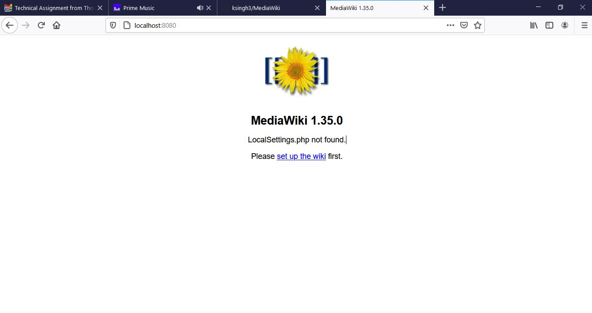
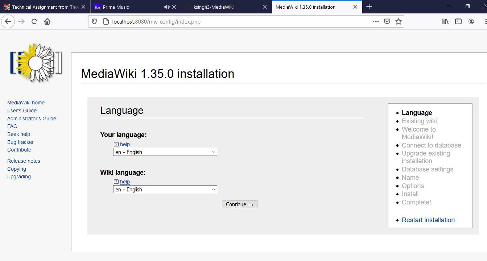
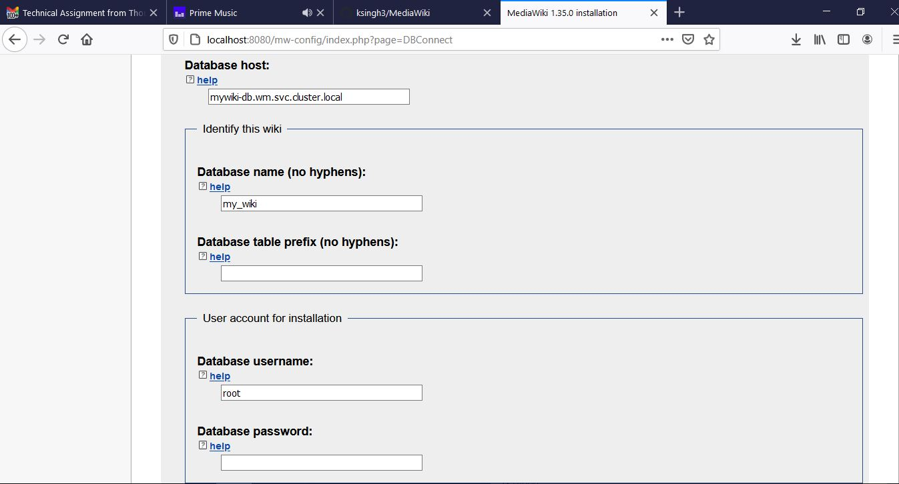
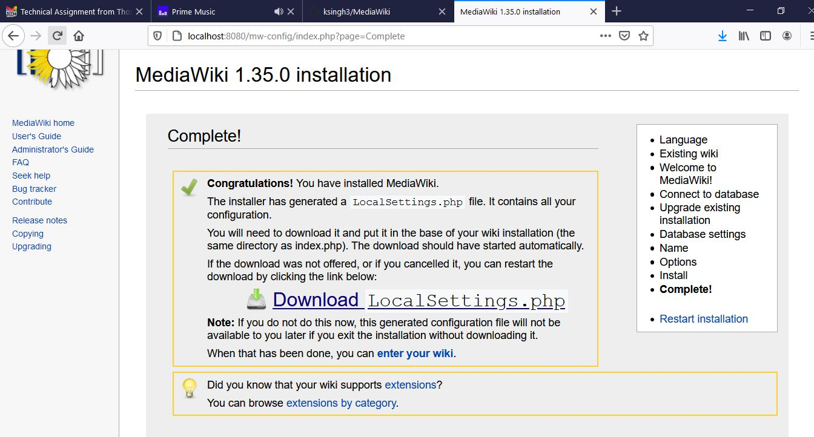
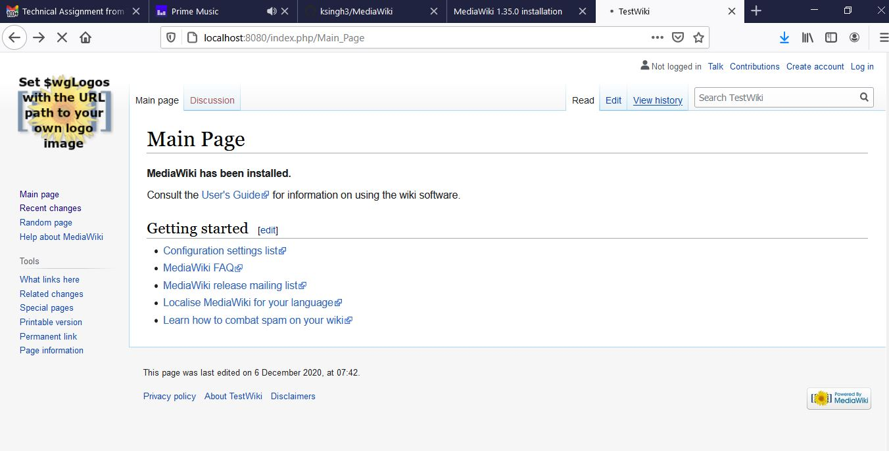

## MediaWiki

This project containerizes the Media Wiki application along with Mariadb under Centos 7.

## Install

Following are the prerequisite before going forward:
- [Docker](https://docs.docker.com/engine/install/ubuntu/)
- [Helm v3.1.3](https://helm.sh/docs/intro/install/) 
- [Kubectl](https://kubernetes.io/docs/tasks/tools/install-kubectl/) 

## Docs

### Docker image:
You can use my docker hub images, else you can create you own image beofre create run docker login.

### Use my docker images
- Application image: [ksingh3/mediawiki:deploy](https://hub.docker.com/layers/ksingh3/mediawiki/tags/)
- Mariadb Image: [ksingh3/mediawiki:db](https://hub.docker.com/layers/ksingh3/mediawiki/tags/)

```shell
$ docker pull ksingh3/mediawiki:deploy
$ docker pull ksingh3/mediawiki:db
```

### Docker login
If you want to create you own image login to docker hub before proceeding and complete the authentication

```shell
$ docker login
```
### Clone this repo 
```shell
$ git clone https://github.com/ksingh3/MediaWiki.git
```

### Build application image
```shell
$ cd MediaWiki/Docker/Application
$ docker build -t ksingh3/mediawiki:deploy .
```

### Build database image 
```shell
$ cd /MediaWiki/Docker/Database
$ docker build -t ksingh3/mediawiki:db .
```

### Create a namespace 
```shell
$ kubectl create ns wm
```

### Install Maridb chart
``` shell
$ cd MediaWiki/Charts/mywiki-db
$ helm upgrade --install mywiki-db -f values.yaml . -n wm
```

### Configure Mariadb one time
Login to Database pod 
``` shell
$ export POD_NAME=$(kubectl get pods --namespace wm -l "app.kubernetes.io/name=mywiki-db,app.kubernetes.io/instance=mywiki-db" -o jsonpath="{.items[0].metadata.name}")
$ kubectl exec -it $POD_NAME -n wm bash
```

Open mysql terminal
```shell
$ mysql
```

Run to give perms to root user
```shell
mysql> GRANT ALL PRIVILEGES ON *.* TO 'root'@'%'; FLUSH PRIVILEGES;
```
Exit from the pod.

### Mariadb hostname
mywiki-db.wm.svc.cluster.local


### Install the application
```shell
$ cd MediaWiki/Charts/mywiki
$ helm upgrade --install mywiki -f values.yaml . -n wm
```

### Port forward to access from local
 ```shell
 $ export POD_NAME=$(kubectl get pods --namespace wm -l "app.kubernetes.io/name=mywiki,app.kubernetes.io/instance=mywiki" -o jsonpath="{.items[0].metadata.name}")
 $ kubectl --namespace wm port-forward $POD_NAME 8080:80
```

## Setup the Application 
Open the application on [http://localhost:8080](http://localhost:8080)
<table>
  <tr>
    <td></td>
 </tr>
 <tr>
    <td></td>
 </tr>
 </table>

### Database hostname
update the hostname to mywiki-db.wm.svc.cluster.local

<table>
  <tr>
    <td></td>
 </tr>
 <tr>
    <td></td>
 </tr>
 </table>

## Update Application helm chart.
### Download LocalSettings.php
### Update Values.yaml
Update config property in File: [Values.yaml](https://github.com/ksingh3/MediaWiki/blob/3dc5d3103759b4c2bd52975859ec31468606ec89/Charts/mywiki/values.yaml#L40-L138) using the downloaded LocalSettings.php.

### Re-run the helm upgrade with upgrade=Yes
```shell
helm upgrade --install mywiki -f values.yaml . -n wm --set upgrade=Yes
```
This time it will mount LocalSettings.php file under `/var/www/html/` using config map.

<table>
  <tr>
    <td></td>
 </tr>
 </table>


## Rolling updates Automation
To automate rolling update, we can make use of secrets under Settings and making use of following 
Action: https://github.com/marketplace/actions/helm-3
``` shell
name: Deploy
on:
  release:
    types: [created]
jobs:
  deployment:
    runs-on: 'ubuntu-latest'
    steps:
      - uses: actions/checkout@v1
      - name: Deploy
        uses: WyriHaximus/github-action-helm3@v2
        with:
          exec: helm upgrade --install mywiki -f values.yaml . -n wm --set upgrade=Yes
          kubeconfig: '${{ secrets.KUBECONFIG }}'
```
secrets.KUBECONFIG is kubeconfig saved inside github secrets.
